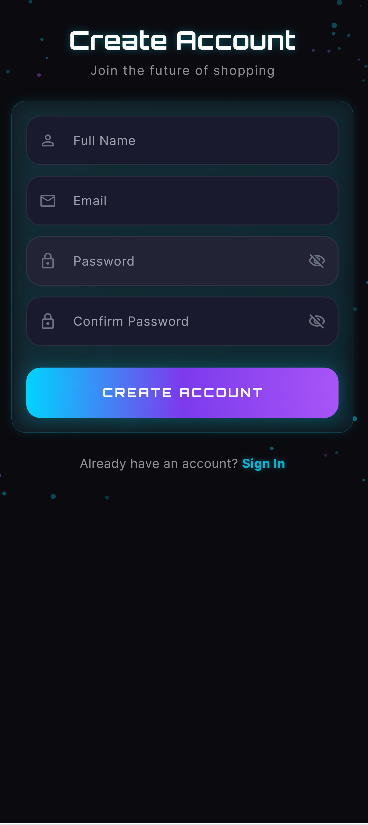
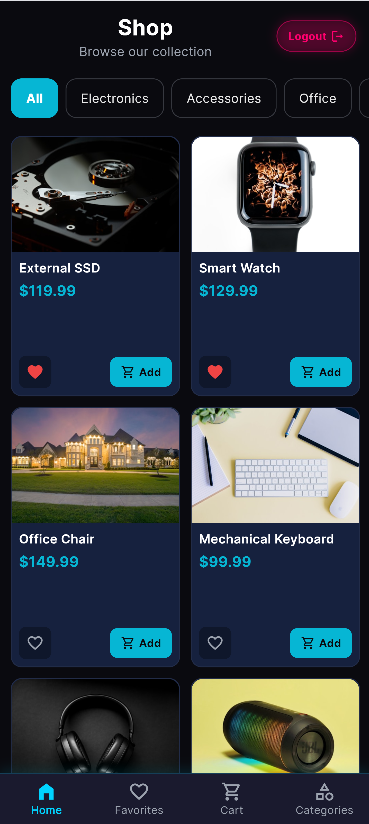
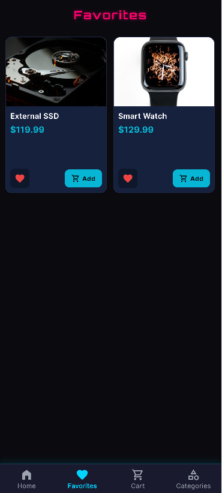
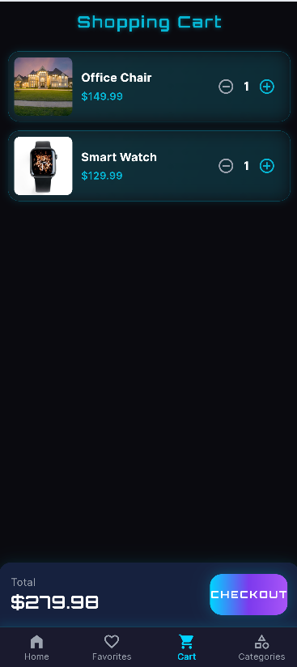
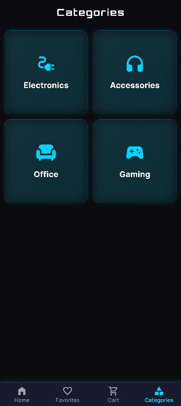

🛒 NeonShop

«A modern, cyber-neon themed e-commerce application built with Flutter and Firebase.»

---

📖 Overview

NeonShop is a university mobile application project developed using Flutter and Firebase. The application demonstrates the integration of modern mobile development technologies with cloud services while following a clean and organized Feature-Based Architecture.

The application provides users with a complete shopping experience, including secure authentication, real-time product browsing, category-based filtering, favorites management, and a persistent shopping cart, all wrapped in a sleek cyber-neon user interface.

---

✨ Features

🔐 Authentication & Security

- User registration using Email and Password.
- Secure login using Firebase Authentication.
- Splash screen authentication verification.
- Automatic session restoration.
- Secure logout functionality.

🛍️ Products & Categories

- Real-time product loading from Cloud Firestore.
- Dynamic category filtering.
- Product availability information.
- Product stock display.
- Responsive product grid layout.

❤️ Favorites

- Add products to favorites.
- Remove products from favorites.
- User-specific favorites synchronized with Firestore.
- Persistent favorites across sessions.

🛒 Shopping Cart

- Add products to the shopping cart.
- Remove products from the cart.
- Increase and decrease product quantities.
- Persistent shopping cart synchronized with Firestore.

🎨 User Interface

- Cyber-neon dark theme.
- Modern shopping experience.
- Smooth navigation between screens.
- Reusable custom widgets.

---

🛠️ Technologies Used

Frontend

- Flutter
- Dart

State Management

- Provider

Backend

- Firebase Authentication
- Cloud Firestore

Architecture

- Feature-Based Architecture
- Provider Pattern
- Service Layer Pattern

---

📂 Project Structure

flutter_application_1/
│
├── android/
├── ios/
├── web/
├── linux/
├── macos/
├── assets/
│
├── screenshots/
│   ├── login_screen.png
│   ├── register_screen.png
│   ├── home_screen.png
│   ├── favorites_screen.png
│   ├── cart_screen.png
│   └── categories_screen.png
│
├── lib/
│   ├── core/
│   │   ├── constants.dart
│   │   ├── routes.dart
│   │   └── theme.dart
│   │
│   ├── features/
│   │   ├── auth/
│   │   ├── cart/
│   │   ├── favorites/
│   │   ├── home/
│   │   └── products/
│   │
│   ├── shared/
│   │   └── widgets/
│   │
│   ├── firebase_options.dart
│   └── main.dart
│
├── pubspec.yaml
├── README.md
└── .gitignore

---

📱 Application Screens

🔑 Login Screen

Allows registered users to securely access the application.

---

📝 Register Screen

Enables new users to create accounts using Firebase Authentication.

---

🏠 Home Screen

Displays products retrieved from Cloud Firestore with category filtering support.

---

❤️ Favorites Screen

Shows products saved by the authenticated user for future access.

---

🛒 Cart Screen

Allows users to manage products added to their shopping cart.

---

📂 Categories Screen

Displays available categories and provides quick product filtering.

---

🌐 Supported Platforms

- Android
- Web

---

👨‍💻 Developer

Developed by:

__Mohammed Abduldaem Abdulghani Al-Mahmoudi__

__Information Technology Student__

---

